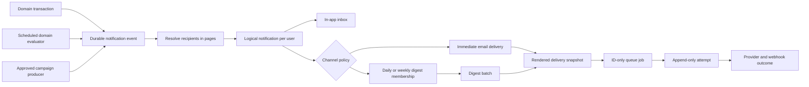

# Notification Platform Architecture

**Status:** Reviewed — final for interface and system design  
**Implementation status:** Not started  
**Primary language in v1:** Romanian  
**Initial delivery channels:** In-app inbox and email  
**Next planned channel:** Browser push, after v1

## 1. Why this document exists

The application already has a working email notification system. It started with a narrow purpose: users subscribed to periodic budget updates for public entities. It was later extended with alerts, campaign preferences, public-debate events, welcome messages, administrative sends, and other feature-specific flows.

The current system has useful reliability mechanisms, but its persisted model still assumes that a notification is mostly an email generated from a subscription. Continuing to add features to that model would make subscriptions, product rules, rendered content, delivery state, and retry behavior increasingly difficult to understand.

This document records the product and technical decisions for a reusable notification platform. It is intentionally a review document, not an implementation report. The goal is to make the architecture understandable enough that product, backend, frontend, security, and operations can challenge it before code or migrations are written.

## 2. Executive summary

The proposed platform separates five concepts that are currently mixed together:

1. A **notification event** records that something happened in the application.
2. A **subscription** records that a user wants updates about a subject.
3. A **logical notification** records the user-facing message created for one recipient.
4. A **delivery** records how that logical notification should be delivered through a channel.
5. A **delivery attempt** records each interaction with an external provider.

In plain terms: today, "a notification" is one email row that plays all five roles at once. That works until two channels (inbox and email) need different content and different outcomes for the same occurrence, or until support asks "which vote caused this email, who else got it, and what exactly did they see?" Separating the five records means each question — _what happened_, _who asked to know_, _what did we tell this person_, _how did we send it_, _what did the provider say_ — has exactly one place where the answer lives, and a failure at one step never erases the record of the steps before it.

The platform remains part of the existing application and uses PostgreSQL and BullMQ. It does not introduce a new microservice, Kafka, or a configurable business-rule engine.

Domain modules remain responsible for knowing that a vote happened, deciding what a legislative initiative is, authorizing a subscription, and providing the immutable facts required for the message. The notification platform becomes responsible for durable event recording, recipient expansion, preferences, inbox history, rendering, scheduling, channel delivery, retries, idempotency, audit, retention, and operations.

The first proof of the design will be:

- A new parliamentary vote notification for users following a legislative initiative.
- Migration of one existing periodic budget newsletter flow.

The legacy delivery system will remain active during migration. Each notification kind will run in shadow mode and then be switched independently, with only one sender active at a time.

## 3. Current implementation

### 3.1 Original use case

The original notification model was built around a user subscribing to periodic updates for a public entity. The subscription identified the user, entity, and newsletter frequency. A later process collected eligible subscriptions, composed an email from current budget data, and sent it.

That design made two good separations:

- Product code decides whether a notification should exist, who should receive it, and which template applies.
- Delivery code queues, composes, sends, retries, and reconciles provider state.

Those responsibilities should remain separate.

### 3.2 How it works today

The current `Notifications` table represents several concepts:

- Entity newsletter subscriptions.
- Alert definitions and JSON configuration.
- Campaign-wide and entity-specific preferences.
- Global email unsubscribe state.

The current `NotificationsOutbox` table represents an email-shaped recipient occurrence. It contains the user, notification type, subscription reference, deduplication key, rendered subject and bodies, destination email, provider ID, status, attempt count, latest error, and metadata.

There are two main creation paths:

- **Periodic subscription flows** collect eligible subscription IDs, reload live data, compose content, insert an outbox row, and enqueue it.
- **Direct event and campaign flows** resolve recipients in feature-specific handlers and insert unrendered outbox rows containing feature payloads in metadata.

The workers use ID-only BullMQ jobs and database claims for collect, compose, send, and recovery stages. Resend is currently the email provider.

### 3.3 Guarantees the current system provides

The current system provides useful but limited guarantees:

- A unique subscription hash prevents duplicate subscription rows.
- A unique delivery key prevents the same expected outbox row from being created twice.
- Atomic claim operations protect compose and send work from ordinary concurrent processing.
- Queue jobs contain persisted IDs instead of sensitive message bodies.
- Recovery jobs find some database work that was not queued or was abandoned by a worker.
- Provider idempotency reduces duplicate email sends within the provider's idempotency window.
- Provider webhook events are persisted before their side effects are applied.
- Signed unsubscribe links, webhook verification, redacted logging, and user-deletion anonymization already exist.

The system does **not** provide exactly-once delivery. A provider may accept an email immediately before the worker fails to persist the acceptance. The system can safely retry inside the provider idempotency window, but an outage beyond that window creates an ambiguous outcome.

### 3.4 Main limitations

- The subscription, preference, notification, rendered email, and delivery concepts are not distinct.
- There is no durable application-event record or direct event-to-notification relationship.
- The model is email-specific and has no channel abstraction.
- There is no general in-app inbox, unread count, or read/archive state.
- Recipient selection and payload interpretation are spread across feature-specific code.
- Template selection is still centralized in a large hard-coded composition branch.
- Periodic content is recreated from live data, so it may change after the triggering condition occurred.
- Only the latest delivery error and an aggregate attempt count are stored; individual attempts are not auditable.
- The declared dead-letter queue is not a complete operational workflow.
- A subscription deletion can also remove delivery history and the original deduplication barrier.
- There is no generic scheduling, expiry, digest membership, or destination-suppression model.
- Retention is effectively indefinite for rendered bodies and provider payloads.
- User-facing history and administrative audit are limited to selected notification types.

### 3.5 Existing parts to preserve

The new platform should reuse or evolve these parts instead of replacing them without cause:

- The separation between notification decisions and channel delivery.
- The TypeBox-validated, versioned, server-controlled template registry.
- Persisted rendered snapshots and content hashes.
- Database uniqueness for idempotency.
- Race-safe create-or-reuse behavior.
- Atomic worker claims and stale-worker protection.
- ID-only queue payloads.
- Provider adapters, rate limiting, and stable provider idempotency keys.
- Persist-first, idempotent webhook processing.
- Recovery scans for database-to-queue gaps.
- Signed unsubscribe links and send-time eligibility checks.
- Redacted logging and user-deletion anonymization.
- Administrative dry runs, stored plans, previews, and revalidation for sensitive bulk sends.

## 4. Goals and non-goals

### 4.1 Goals

The platform must:

- Support event-driven and scheduled notification generation.
- Support explicit subscriptions and narrowly defined policy-based eligibility.
- Create one durable, channel-neutral notification for each recipient.
- Support an in-app inbox and email in v1.
- Let channels use different content, timing, and delivery outcomes.
- Add daily and weekly email digests without replacing individual inbox items.
- Apply global and per-channel preferences consistently.
- Preserve immutable facts and the exact rendered content used for each channel.
- Prevent duplicate logical records through deterministic keys.
- Provide at-least-once processing with bounded external-delivery retries.
- Record every delivery attempt and support visible, audited dead-letter recovery.
- Bound per-user email volume: a digest email renders at most a fixed number of items with an overflow link to the inbox (§6.8).
- Provide an event-to-recipient-to-delivery audit trail.
- Protect user data and correctly handle account deletion.
- Remain understandable and operable at the expected scale.
- Allow a feature to adopt notifications without reimplementing queue, retry, preference, and delivery behavior.

### 4.2 Non-goals

V1 will not:

- Become a generic domain rule engine.
- Let clients submit arbitrary templates, recipients, or send requests.
- Support anonymous destinations as first-class recipients.
- Support organization-owned inboxes or multi-tenant notification ownership.
- Support per-subscription preference overrides.
- Support quiet hours, arbitrary user schedules, or per-user time zones.
- Implement mobile push or browser push delivery.
- Introduce a separate notification microservice or event broker.
- Promise exactly-once external delivery or provider presentation order.
- Migrate every existing notification flow in one release.

## 5. Architecture overview



The database is the source of truth. BullMQ is an execution accelerator, not the only record that work exists. If an event, notification, or delivery is persisted but its queue publication fails, a recovery process can enqueue it later.

For both v1 proof cases, the "domain transaction" box above is reached through idempotent reconciliation ingestion rather than a shared transaction, because the domain data lives in databases separate from the notification tables. Section 8.1 specifies this reconciliation-first capture path and its cadence.

## 6. Core concepts

### 6.1 Notification event

A notification event is the durable record that something happened which may produce notifications.

Examples:

- `parliament.vote.created`
- `budget.newsletter.period.closed`
- `public-debate.correspondence.received`
- `account.welcome.requested`

A notification event contains:

- A stable source and event type.
- An event schema version.
- A producer-supplied occurrence key.
- The time the domain event occurred.
- Immutable canonical facts needed for notifications.
- A deterministic payload hash.
- Optional correlation and causation IDs.
- An optional stream key and monotonic sequence for ordered kinds.
- Processing status, lease, progress cursor, and timestamps.

The unique identity is `(source, event type, occurrence key)`.

If the same key and payload are recorded again, the operation returns the existing event as a successful duplicate. If the same key is reused with different facts, the original event remains unchanged, the conflict is audited, and operators are alerted.

#### Why this exists

It creates a durable relationship between an application occurrence and every notification generated from it. It also closes the gap where a domain action succeeds but transient queue work is lost.

#### Tradeoff

It adds a persisted layer before recipient fan-out. This is more schema and processing than calling an email function directly, but it is the minimum durable boundary needed for multi-channel delivery, reconciliation, and audit.

### 6.2 Notification subscription

A subscription records explicit user intent to receive a registered notification kind for a subject.

It contains:

- User ID.
- Notification kind.
- Subject type and subject ID.
- TypeBox-validated configuration.
- A normalized deterministic subscription key.
- Active, paused, or removed state and timestamps.

Examples:

- A user follows legislative initiative `initiative:123` for new votes.
- A user follows public entity `cui:456` for a monthly budget newsletter.
- A user configures a typed threshold alert for a budget series.

The generic platform stores the subscription, but the owning domain validates that the subject exists and that the user may follow it. A subject is not treated as an unvalidated arbitrary string.

Subscription deletion never deletes notification events, logical notification history, deliveries, attempts, or deduplication records.

#### Why use a generic subscription record

It avoids building separate CRUD, uniqueness, preference, and audit behavior for every product while retaining domain authorization and typed configuration.

#### Tradeoff

Cross-domain subjects cannot all use one relational foreign key. The domain adapter must validate subject identity and authorization, and cleanup/reconciliation must handle subjects that are later removed.

### 6.3 Notification preferences

V1 has two preference levels:

- A global switch for optional notifications.
- A setting for each channel.

Channel settings contain:

- Enabled or disabled.
- `immediate`, `daily`, `weekly`, or `off`, where the notification kind permits that cadence.

V1 intentionally has no per-topic or per-subscription preference override.

Each registered notification kind declares one preference class:

| Class                   | Meaning                                                                                 |
| ----------------------- | --------------------------------------------------------------------------------------- |
| `subscription-required` | A matching active subscription is required.                                             |
| `opt-out`               | A product policy selects the recipient, but optional preferences apply.                 |
| `required`              | A narrowly defined service, legal, or security message may bypass optional preferences. |

Feature code cannot mark a single occurrence as required. Required status belongs to the reviewed, code-owned kind definition and every bypass is audited.

Preference evaluation happens twice:

1. During recipient resolution, to decide whether a new logical notification should exist.
2. Immediately before external delivery, to respect account deletion, a late opt-out, channel changes, destination suppression, and expiry.

A late preference change can cancel an unsent email but does not remove an inbox item that was already created.

For an optional kind, global pause prevents the logical notification from being created. When global notifications are enabled, a logical notification is created only if at least one permitted channel is enabled for the user. For example, disabling email still allows an inbox item, while disabling both email and inbox records only a redacted skipped decision. Required kinds follow their reviewed kind policy but still require a valid, non-suppressed destination for external delivery.

Cadence changes apply to newly generated notifications. Turning a channel off or using the global pause cancels pending external work.

#### Advantage

This creates predictable consent behavior without a complex inheritance tree.

#### Tradeoff

Users cannot choose a different cadence for individual subjects in v1. That can be added later only if user research justifies the additional UI and policy complexity.

### 6.4 Logical notification

A logical notification is one channel-neutral user-facing record created from an event for one recipient.

Its unique identity is `(event, notification kind, user)`.

It contains:

- Event and kind references.
- User ID.
- The eligibility decision and reason.
- Locale, fixed to `ro` in v1.
- Minimal recipient-specific facts, if required.
- Pinned inbox template ID and version.
- Rendered inbox title, body, and action link.
- Inbox visibility.
- `read_at` and `archived_at` timestamps.
- Optional ordering stream information.
- Creation and retention timestamps.

The logical notification does not have one combined delivery status. Email may fail while the inbox item remains available. Future browser push may be accepted while email is suppressed. Each channel keeps its own state.

#### Advantage

Email, inbox, and future push all refer to the same user-facing occurrence without pretending that their content and delivery outcomes are identical.

#### Tradeoff

The schema contains more rows than the current single email outbox. This additional normalization is deliberate because channel-independent inbox state and channel-specific delivery state have different lifecycles.

### 6.5 Notification delivery

A delivery represents one dispatch through one channel to one destination, or one digest dispatch containing several logical notifications.

It contains:

- A stable delivery key.
- Either one logical-notification parent or one digest-batch parent.
- Channel.
- Destination fingerprint and current destination snapshot needed for retry.
- Template ID and version.
- Rendered subject, HTML, text, or channel-specific content.
- Content hash.
- `not_before` and optional expiry.
- Claim lease and retry scheduling state.
- Provider idempotency key and provider reference.
- Current delivery state and timestamps.

Delivery state is explicit:

- `pending_render`
- `scheduled`
- `ready`
- `sending`
- `retry_wait`
- `accepted`
- `delivered`
- `bounced`
- `complained`
- `suppressed`
- `cancelled`
- `expired`
- `permanent_failed`
- `dead_letter`
- `unknown`

`accepted` means the provider accepted responsibility for the request. It does not mean the human saw the notification. `delivered` is used only when the channel can report that outcome.

### 6.6 Delivery attempt

Every call to an external provider creates an append-only attempt before the provider is contacted.

It contains:

- Delivery ID and attempt number.
- Start and completion timestamps.
- Provider idempotency key and request correlation.
- Destination fingerprint.
- Classified result: accepted, transient failure, permanent failure, or ambiguous.
- Redacted error code and message.
- Provider reference, when known.
- Response latency and relevant retry hints.

Attempts are never overwritten by the next retry. This is the operational history used for support and failure analysis.

### 6.7 Channel destination

A channel destination represents the technical health of a contact point. In v1, this is the user's current verified email destination. The same contract will later support browser-push subscriptions.

Destination state is separate from preference state:

- A hard bounce or complaint suppresses the specific email destination.
- Suppression stops pending and future sends to that destination.
- It does not silently rewrite the user's email preference.
- A newly verified address has a different fingerprint and can restore email eligibility.

**The platform never persists destination details.** It stores only an HMAC fingerprint of the normalized address, a generation counter, and suppression state. The actual address is resolved from the identity provider at send time and exists only in memory during the send; if the re-resolved fingerprint no longer matches the one the delivery was planned against, the delivery is cancelled as `destination_changed` rather than silently sent to a different address. Administrative views show only fingerprints and suppression reasons; revealing an actual destination is a privileged, audited, live identity-provider lookup — never a database read.

### 6.8 Digest batch

A digest is a channel delivery batch over existing logical notifications. It is not a replacement logical notification.

Consequences:

- Every event remains an individual inbox item.
- A daily or weekly email can include several of those items.
- The batch has a unique `(user, channel, cadence, time window)` identity.
- Membership has a unique `(batch, logical notification)` identity.
- The digest rendering and exact included item IDs are snapshotted.

V1 defaults:

- Daily email digest at 08:00 Europe/Bucharest.
- Weekly email digest Monday at 08:00 Europe/Bucharest.
- Computed UTC windows are persisted so daylight-saving transitions are reproducible.
- Existing monthly, quarterly, and yearly newsletters remain scheduled notification kinds rather than user-selectable digest cadences.
- A digest email renders at most **20 items**, newest first, followed by an "and N more in your inbox" link. All members remain in the batch record and the inbox; the cap bounds only the rendered email size.

Digest batches are **immutable snapshots** once rendered. Ordinary user actions — reading or archiving an inbox item — never modify an already-snapshotted batch. The only way to change a pending batch is to cancel it entirely, and the only sanctioned trigger for that is a legal or redaction event against included content. There is no per-item removal from a snapshotted batch; this reuses the existing delivery-cancellation mechanism instead of adding a batch-editing workflow.

#### Advantage

The inbox preserves event-level history while email volume can be reduced.

#### Tradeoff

Digest batching adds membership and window state. It also means inbox visibility can occur well before the corresponding digest email.

### 6.9 Audit event

The audit ledger records important lifecycle and administrative actions in a redacted form:

- Event accepted, duplicated, conflicted, or resolved.
- Recipient included or skipped and the policy reason.
- Logical notification and delivery created.
- Delivery moved to a terminal state.
- Destination suppressed or restored.
- Administrator revealed content.
- Administrator requeued or resolved dead-letter work.
- User data was anonymized.

The audit ledger is append-only and retained indefinitely. Detailed content, provider payloads, and attempts have shorter retention.

## 7. Notification kind registry

Every supported notification kind is declared in a code-owned registry. Adding a feature requires a small, reviewed definition instead of custom queue and retry code.

A kind definition declares:

- Stable kind ID and version.
- Exactly one accepted event type and its TypeBox event schema. The relationship is strictly one-to-one: a kind accepts one event type, and an event type feeds one kind. One occurrence never fans out into multiple kinds; a product need for two different messages from one occurrence means defining two event types.
- Subscription configuration schema, if applicable.
- Allowed subject types.
- Domain authorization adapter.
- Recipient resolution strategy.
- Preference class.
- Supported channels.
- Allowed and default channel cadences.
- Per-kind delivery expiry.
- Optional ordering policy.
- Canonical-facts projector and redaction policy.
- Inbox and email template IDs and versions.

The registry is server-controlled. Templates are changed through reviewed deployments. V1 does not include a template CMS or database-edited content overrides.

#### Advantage

The registry makes the contract discoverable, type-safe, testable, and difficult to bypass accidentally.

#### Tradeoff

Template and notification-policy changes require a deployment. This is intentional for v1 because the current volume and team needs do not justify building drafts, approvals, rollback, validation, and injection protection for a template CMS.

## 8. Event capture and recipient resolution

### 8.1 Event capture

**Reconciliation-first is the primary capture path in v1.** This is a deliberate inversion of the usual "transactional outbox first" presentation, because of a topology fact: neither proof case can share a transaction with the notification tables. Parliamentary vote data lives in a separate, read-only production database with no write path at all, and budget data uses a Postgres connection separate from the user/notification database. No cross-database transaction mechanism exists in the codebase, and this document does not introduce one.

The primary path works as follows:

- Each event source declares a stable occurrence-key scheme and a persisted **watermark** (for example, the highest ingested vote ID and revision per initiative, or the last closed reporting period per entity and newsletter kind).
- An **ingestion scan** polls each upstream source every **60 seconds**, reads records past the watermark, and records notification events idempotently. The unique `(source, event type, occurrence key)` identity makes overlapping or restarted scans safe; the watermark advances only after the events it covers are durably recorded.
- Scheduled evaluators (the budget newsletter) do not need the poll: the evaluator itself materializes facts and records the event when it runs.
- External webhooks are ingested idempotently on arrival, with the same occurrence-key discipline.
- A **recovery scan** runs every **2 minutes** and enqueues persisted events, notifications, or deliveries that have no active queue job.

These two cadences are the real determinants of event-to-inbox latency for reconciled sources, and the latency targets in §19 are set from them, not from an assumed instant enqueue.

Where the domain change and the notification tables do share the user database, the domain transaction writes the event record atomically and a rollback removes both. This stronger path remains available and preferred for future kinds whose domain data lives there, but no v1 proof case uses it.

Queue jobs contain only event or delivery IDs.

#### In plain terms

The problem this machinery solves: the things we notify about (a parliamentary vote, a closed budget period) are recorded in one database, and our notification records live in another. There is no way to say "save the vote and the notification together, or neither" across two databases. So instead of being _told_ when something happens, the platform periodically _looks_.

- The **ingestion scan** is that look: every minute, it asks each source "what is new since the last thing I saw?"
- The **watermark** is the bookmark that remembers where the last look ended, so nothing is skipped and nothing is read twice from scratch.
- The **occurrence key** is the guarantee that even if the same vote is noticed twice (a restarted scan, an overlapping look), only one notification event is ever created — the second notice finds the first record and stops.
- The **recovery scan** is the safety net for the opposite failure: the event was saved, but the follow-up work message got lost. It finds saved work with no worker assigned and re-dispatches it.

The cost of this design is honesty about latency: a notification appears within about a minute of the scan noticing the change, not within milliseconds of the change itself. The benefit is that nothing is ever silently lost — every step either completed and was recorded, or will be found and retried by one of the two scans.

### 8.2 Recipient resolution

Recipients are resolved once when the event is processed.

- Subscription-based kinds use the generic subscription store and domain subject policy.
- Policy-based kinds use a reviewed paginated resolver.
- Group or organization selectors resolve to authenticated user IDs; the group itself is not the recipient.
- Resolution uses keyset pages with a default page size of 500.
- Progress is persisted so a worker can resume after failure.
- Unique logical-notification keys make replay safe.
- Users who subscribe after resolution do not receive the old event.

The platform persists the eligibility reason used for every created logical notification. Skipped decisions are kept only as redacted audit information where operationally useful.

#### Why resolution does not happen at delivery time

Resolving at delivery time could produce different recipient sets for inbox, immediate email, and a later digest. It would also weaken the audit relationship between the event and the original audience.

#### Tradeoff

Preferences are evaluated at resolution time rather than at the precise domain-event timestamp. This avoids an expensive event-transaction snapshot of a potentially large audience. The event time and resolution time are both stored for support.

## 9. Content and templates

The event must contain or materialize the canonical facts needed to explain what happened. Delivery must not refetch mutable domain data to reconstruct the message.

For a parliamentary vote, the snapshot may include:

- Vote ID and time.
- Legislative initiative ID and display title.
- Vote result or status.
- Stable application URL.
- Other public facts required by the approved templates.

For a budget newsletter, the scheduled evaluator snapshots the report facts for the entity and reporting period before recipient expansion.

The platform persists:

- Canonical event facts.
- Minimal recipient-specific facts, only when necessary.
- Pinned template IDs and versions.
- Exact inbox rendering.
- Exact email or digest rendering and content hash.

V1 renders Romanian only, but `locale = ro` remains explicit in persisted records and interfaces so future localization does not require redefining identity or history.

#### Advantage

Support can reproduce what the user saw even if a domain record or template later changes.

#### Tradeoff

Snapshots consume more storage and may contain personal data. The design therefore includes field-level redaction policy, access controls, user-deletion handling, and bounded content retention.

## 10. Inbox behavior

The logical notification is the source of truth for the in-app inbox.

V1 supports:

- Cursor-paginated `all`, `unread`, and `archived` views.
- An unread count.
- Mark read and mark unread.
- Mark all read.
- Archive and unarchive.
- A dedicated inbox page.
- A periodically refreshed unread navigation badge.

V1 does not support dismiss or user-initiated deletion. Archive is reversible and separates an item from the active view without destroying audit history.

The inbox is delivered through ordinary APIs and TanStack Query polling. V1 does not add WebSockets or server-sent events. Client mutations update or invalidate the unread count immediately.

#### Advantage

The inbox is reliable and simple to operate without new realtime infrastructure.

#### Tradeoff

An open client may see a short delay before a notification or unread badge appears. The p95 target is visibility within five minutes of the occurrence becoming ingestable (§19), reflecting the reconciliation-first capture path in §8.1 plus polling.

## 11. Scheduling, expiry, and ordering

### 11.1 Immediate and delayed delivery

Every external delivery may have a durable `not_before` timestamp. Rendering can occur before that timestamp; the timestamp controls when provider delivery becomes eligible.

Scheduled domain checks remain outside the generic platform. They emit ordinary events with stable keys.

### 11.2 Expiry

Each notification kind may define an external-delivery expiry. Workers cancel unsent delivery after that time and record `expired` as the reason. The logical inbox item and audit relationship remain available until retention applies.

There is no global expiry because urgent alerts, event updates, and scheduled reports have different useful lifetimes.

### 11.3 Ordering

There is no global ordering and no default serialization of every notification for a user.

A kind that requires ordering supplies:

- A stable stream key.
- A monotonic sequence.
- An ordering declaration in its kind definition.

For such a kind, the platform preserves inbox order and dispatch order for the same recipient, channel, and stream. Unrelated streams continue concurrently. A permanently failed earlier delivery releases later work after the failure is recorded.

The enforcement mechanism is a **single dispatch lane per stream key**: at most one delivery per `(recipient, channel, stream key)` is in flight at a time, and the next is released when the previous reaches `accepted` or a terminal state. Provider acceptance fixes dispatch order; waiting for a delivery webhook would only stall the stream. Because open-source BullMQ has no native per-key FIFO groups (§19), the lane is enforced at the database layer — the delivery claim query skips a delivery whose stream predecessor is not yet released — rather than by queue topology. The queue merely dispatches candidates; the database claim decides eligibility, consistent with the claim pattern used everywhere else in this design.

The platform cannot guarantee the order in which an external email client displays messages after provider acceptance.

#### Advantage

Only flows that need ordering pay the serialization cost.

#### Tradeoff

An ordered stream can be delayed by an earlier retry. Producers must also supply correct stream identities and monotonic sequences.

## 12. Idempotency and delivery guarantees

The platform uses different idempotency identities at each layer:

| Layer                | Unique identity                                       |
| -------------------- | ----------------------------------------------------- |
| Event                | Source, event type, occurrence key                    |
| Subscription         | User, kind, normalized subscription key               |
| Logical notification | Event, kind, user                                     |
| Immediate delivery   | Logical notification, channel, destination generation |
| Digest batch         | User, channel, cadence, time window                   |
| Digest membership    | Digest batch, logical notification                    |
| Attempt              | Delivery, attempt number                              |

The producer owns the event occurrence key. Payload hashing detects invalid key reuse. A subscription row ID is never part of event or delivery identity, so unsubscribing and resubscribing cannot remove the duplicate barrier for an old event.

The formal guarantee is:

- Database and queue processing are at least once.
- Database-visible effects are effectively once through unique keys and conditional transitions.
- External delivery is attempted with stable provider idempotency where available.
- Literal exactly-once provider delivery and human receipt are not promised.

## 13. Retry, failure, and dead-letter behavior

### 13.1 Default email retry policy

- Maximum five attempts.
- Maximum retry window of 24 hours.
- Capped exponential backoff with jitter.
- Provider `retry-after` guidance is honored where available.
- A shorter per-kind expiry takes precedence.

Transient failures include timeouts, temporary network failures, provider rate limiting, and provider 5xx responses. Validation errors, invalid request content, and other definitive provider rejections are permanent.

### 13.2 Ambiguous provider outcomes

An ambiguous outcome occurs when the provider may have accepted a send but the application did not persist confirmation.

The recovery sequence is:

1. Reuse the same provider idempotency key while its valid window remains.
2. Query or reconcile provider state where supported.
3. Use persisted provider webhooks if they identify the request.
4. If the outcome remains unknown after the idempotency window, move the delivery to `unknown` and dead letter.

The platform does not automatically resend an unknown delivery after the safe idempotency window. An administrator must make an audited decision acknowledging duplicate risk.

### 13.3 Persistent dead letter

Dead-letter state is stored in PostgreSQL and is not dependent on failed BullMQ jobs being retained.

The administrative workflow supports:

- Search and filtering by kind, channel, status, event, and user metadata.
- Full attempt timeline.
- Redacted error information by default.
- Privileged content reveal with a recorded reason.
- Idempotent requeue with a recorded reason.
- Special acknowledgement before retrying an ambiguous send.

#### Advantage

Failures become visible, durable, explainable, and recoverable.

#### Tradeoff

Operators must own alerts and dead-letter review. A dead-letter table without an operational routine would only move hidden failures from one place to another.

## 14. Webhook behavior

Provider webhooks remain persist-first:

1. Verify the provider signature.
2. Persist the provider event using its unique provider event ID.
3. Apply normalized, idempotent side effects.
4. Record the resulting audit transition.

State transitions are monotonic. Duplicate or out-of-order webhooks cannot change a terminal failure back to accepted or create another user notification.

Hard bounces and complaints suppress the destination. Temporary delivery events do not change user intent.

## 15. Security, privacy, and authorization

### 15.1 Trust boundaries

- Only internal, registered producers can record notification events.
- There is no public arbitrary recipient/template/send endpoint.
- User APIs are scoped to the authenticated Clerk user.
- Subscription creation calls the domain authorization adapter.
- Administrative search, requeue, and reveal use separate authorization.
- Campaign planning and approval remain outside the generic platform.

### 15.2 Data minimization

- Event schemas accept only facts needed for notification history and rendering.
- Large domain objects are not copied wholesale.
- Logs and ordinary admin screens use destination fingerprints and redacted errors.
- Provider credentials and future browser-push secrets never enter queue jobs or audit events.
- Full rendered content and destination details require privileged, audited reveal.

### 15.3 User deletion

The Clerk `user.deleted` flow must cover every new user-linked table before rollout.

Deletion will:

- Stop and cancel pending user deliveries.
- Remove user subscriptions and preferences.
- Remove inbox ownership and read/archive state.
- Remove or irreversibly anonymize channel destinations.
- Erase recipient-specific facts and rendered content that contain user data.
- Replace audit identity with a random, non-reversible tombstone.
- Prevent recovery workers from recreating user-linked work.

The treatment of every field must be documented in `docs/USER-DATA-ANONYMIZATION.md` and tested end to end.

## 16. Retention

The agreed default retention policy is:

| Data                                            | Retention  |
| ----------------------------------------------- | ---------- |
| Event facts                                     | Two years  |
| Logical notifications and inbox content         | Two years  |
| Delivery summaries and rendered channel content | Two years  |
| Detailed delivery attempts                      | 90 days    |
| Raw provider webhook payloads                   | 90 days    |
| Redacted audit ledger                           | Indefinite |

Account deletion overrides these normal schedules and removes or anonymizes user-linked data immediately.

Retention jobs must be observable and restartable. At expiry they delete the detailed attempts/webhooks and dependency-ordered logical, delivery, digest, and unreferenced event rows; expired event facts are scrubbed only while a retained logical still references them. Terminal audit facts remain after detailed records are removed. If indefinite audit growth later becomes operationally significant, it can be time-partitioned and archived without changing the logical model.

## 17. Public and internal interfaces

### 17.1 Internal event interface

The primary internal operation is conceptually:

```ts
recordNotificationEvent(input, transaction?)
  -> Result<Created | Duplicate, ValidationError | OccurrenceConflict>
```

The input contains the registered event type, version, occurrence key, occurrence time, immutable facts, and optional ordering/correlation data. When a shared transaction is supplied, event persistence participates in the domain transaction.

### 17.2 User APIs

User-facing notification APIs are **REST-only** and consumed through TanStack Query polling. This deviates from the codebase's usual dual REST + GraphQL pattern per module: the notification surface is CRUD and polling with no cross-entity composition need, so a second GraphQL surface would double the contract area without adding capability. The tradeoff is recorded in §24.

Paths are **unversioned** (`/api/notifications/*`, admin at `/api/admin/notifications/*`) and the API evolves **additively**: new fields are optional, new behavior gets new endpoints, and nothing deployed breaks because the single first-party frontend ships in lockstep with the server. Path version segments (`/v1`, `/v2`) are deliberately avoided — they fragment per resource and never converge. If third-party consumers ever require breaking changes, the escape hatch is Stripe-style date-header version pinning, which layers on cleanly precisely because the paths never encoded a version. Legacy `/api/v1/notifications/*` routes remain untouched as the compatibility facade until retired.

The APIs will cover:

- Subscription list, create, pause/resume, and remove.
- Global optional-notification preference.
- Per-channel enabled state and cadence.
- Cursor-paginated inbox list.
- Unread count.
- Mark read/unread and mark all read.
- Archive/unarchive.

Existing subscription/settings routes remain as a temporary compatibility facade during migration.

### 17.3 Administrative APIs

Administrative APIs will cover:

- Event, recipient, notification, delivery, and attempt tracing.
- Dead-letter and unknown-outcome search.
- Audited requeue.
- Audited content reveal.
- Destination suppression visibility.
- Shadow-run comparison summaries.

Campaign trigger definitions, approvals, stored audience plans, and dry-run business rules remain in the campaign module and submit approved work to the notification platform.

### 17.4 Channel adapter

A channel adapter is responsible for:

- Resolving a valid current destination.
- Rendering or selecting a pinned channel rendering.
- Calling the provider with a stable idempotency key.
- Classifying errors as transient, permanent, or ambiguous.
- Reconciling provider state.
- Normalizing provider webhook outcomes.
- Suppressing an invalid destination.

The v1 implementation adapts the existing email provider. Browser push implements the same lifecycle later; v1 adds only compatible channel and endpoint contracts.

## 18. Main access patterns and indexes

The primary database access patterns are:

- Insert or find an event by occurrence identity.
- Claim pending events and resume paginated fan-out.
- Find active subscriptions by kind and subject.
- Find a user's subscriptions and preferences.
- Insert logical notifications idempotently in batches.
- List a user's inbox by creation cursor and archive/unread filters.
- Count unread visible notifications.
- Claim due deliveries by state and `not_before`.
- Find expired or abandoned claims for recovery.
- Find a digest batch by user, cadence, and time window.
- Trace an event to notifications, deliveries, and attempts.
- Search terminal failures and dead letters.
- Apply retention by terminal timestamp.

Indexes should include:

- Event occurrence uniqueness and partial pending/due indexes.
- Active subscription kind/subject lookup and user lookup.
- Logical-notification event/user uniqueness.
- User inbox cursor and partial unread indexes.
- Delivery-key uniqueness and partial state/`not_before` indexes.
- Attempt delivery/number uniqueness.
- Digest-window uniqueness and membership uniqueness.
- Destination user/channel/fingerprint uniqueness.
- Audit entity/time and user/time lookup.

Claims continue using atomic compare-and-set or `FOR UPDATE SKIP LOCKED` behavior with claim tokens. Workers never load an entire large audience into memory.

## 19. Scale and performance boundaries

V1 is designed for:

- Fewer than 10,000 logical notifications per day.
- Audiences below 10,000 users per occurrence.
- Short event bursts that are smoothed through 500-user fan-out pages and provider backpressure.
- PostgreSQL as the durable store and BullMQ as the worker queue.

These figures are validated against current production subscriber and event volumes, not placeholders.

Operational targets under healthy dependencies and configured provider quota, measured from the moment an occurrence becomes ingestable (visible to the ingestion scan or emitted by a scheduled evaluator):

- p95 inbox visibility within five minutes.
- p95 end-to-end email provider acceptance within fifteen minutes.

These targets budget for the 60-second ingestion scan and 2-minute recovery scan defined in §8.1, fan-out paging, and provider quota, rather than assuming instant enqueue.

Likely first bottlenecks are provider quota, large rendered email storage, unbounded audience queries, retention deletes, and administrative audit scans.

V1 does not partition tables. Partitioning or archival should be reconsidered when any of these occur:

- Sustained volume approaches 100,000 logical notifications per day.
- Hot tables approach roughly 50 million rows or 100 GB.
- Retention deletes cause material vacuum or index pressure.
- A single audience regularly exceeds the current chunking and SLO envelope.
- Redis memory or queue depth grows enough that delayed-job and retry state in a single Redis deployment becomes a durability concern.

At that point, likely improvements are time partitioning, cheaper audit archival, more fan-out workers, or a streaming fan-out mechanism. They do not require changing the event/notification/delivery distinction.

### Queue technology: BullMQ now, a broker like RabbitMQ later

BullMQ (Redis-backed) is deliberately used only as a work-dispatch accelerator. Every job is ID-only, and PostgreSQL is authoritative: unique keys, delivery state, and deduplication all live in the database, and a recovery scan enqueues work whose queue publication was lost. Because of this, no part of the event/notification/delivery/attempt model depends on which broker moves the ID-only jobs — the broker is a swappable component, not a source of truth.

Known limitations of BullMQ in this design:

- No native per-key ordered/grouped processing in the open-source library (per-stream FIFO groups are a paid BullMQ Pro feature). The chosen ordering mechanism — a single dispatch lane per stream key (§11.3) — is therefore enforced by the database claim query (a delivery is claimable only when its stream predecessor is terminal), not by queue topology. This keeps ordering consistent with the database-claim pattern used elsewhere in this design, at the cost of some no-op queue dispatches for not-yet-eligible deliveries.
- Job state (delayed-job schedules, retry counters, payloads) lives in a single Redis deployment's memory. At the stated fewer-than-10,000-notifications-per-day boundary this is a non-issue; Redis memory and queue depth are listed among the scale triggers above.
- BullMQ is Node.js/Redis-specific; a future service written in another language could not produce or consume notification queue work without a bespoke bridge.
- BullMQ has no broker-level flow control spanning multiple queues. Throttling low-priority digest fan-out behind higher-priority immediate sends requires manual per-queue configuration rather than broker-native backpressure.

A broker such as RabbitMQ is a plausible future replacement, not a v1 requirement. What adopting one would mean:

- Genuine gains: native per-routing-key ordered queues (removing the stream-key workaround above), a native dead-letter-exchange model that maps closely onto this document's existing dead-letter concept, quorum queues for stronger broker-level durability than a typical Redis deployment, and straightforward support for non-Node.js consumers.
- Genuine costs: RabbitMQ is new infrastructure to run and operate (a clustered Erlang/OTP runtime, its own monitoring and upgrade path) in addition to Postgres and Redis. BullMQ's TypeScript-first ergonomics — typed jobs, built-in exponential backoff with jitter, delayed jobs, and an admin UI — would need to be rebuilt or replaced by a library layered on top of RabbitMQ.
- Because the database, not the broker, is the source of truth, this replacement would be additive and contained: it would not require redesigning the event/notification/delivery/attempt model, the idempotency keys, or the recovery-scan safety net described in §12. That containment is the main argument for not pre-building a broker abstraction now.
- Suggested triggers to revisit, mirroring the partitioning triggers above: sustained concurrent ordered-stream cardinality that makes the claim-gated lane per key operationally painful, a hard requirement for broker-level backpressure against provider quota, or a second non-Node.js service needing direct queue access.

## 20. Observability and operations

Every record carries correlation identifiers from event through provider attempt.

Metrics should include:

- Event-to-inbox latency.
- Event-to-provider-acceptance latency.
- Queue depth and oldest work age by stage.
- Fan-out progress and failures.
- Render failures.
- Attempts and retries by kind, channel, and provider result.
- Dead-letter and unknown-outcome counts.
- Destination suppressions.
- Webhook ingestion and application lag.
- Digest batch completeness and lateness.
- Retention progress and failures.
- Shadow-generation recipient and content parity.

Alerts should cover:

- Occurrence-key conflicts.
- Inbox or email SLO breaches.
- Stuck claims and growing due backlogs.
- Dead-letter growth.
- Unknown provider outcomes.
- Webhook signature failures or lag.
- Missed digest windows.
- Retention failures.

Dashboards and logs use redacted metadata by default. Support can follow the full event-to-attempt chain without exposing message bodies or addresses during routine investigation.

## 21. Migration strategy

Migration is additive and per notification kind.

### Phase 1: Platform foundation

- Add the new tables and indexes.
- Add kind and channel contracts.
- Add audit and user-deletion coverage.
- Add event fan-out, delivery, retry, recovery, retention, and digest workers.
- Adapt the existing email registry, provider client, webhook handling, rate limiting, and unsubscribe protections.
- Add per-kind shadow and active-sender switches as code-level constants. Which sender is active for a kind is a reviewed constant in the kind registry, changed by deployment — not a runtime flag. This makes the single-active-sender guarantee enforceable by code review and removes an entire class of runtime misconfiguration, at the cost of a deploy cycle per cutover or rollback.

No current producer changes behavior in this phase.

### Phase 2: Inbox and user controls

- Add versioned preferences and inbox APIs.
- Add the client inbox page, unread badge, polling, and read/archive actions.
- Keep notification settings on a separate route.
- Keep existing settings APIs through a compatibility facade.

### Phase 3: Parliamentary vote proof

Add `parliament.vote.created`:

- Occurrence key based on stable vote identity and revision.
- Legislative initiative as the subscription subject.
- Current initiative subscribers resolved once in pages.
- One Romanian logical notification per eligible user.
- Inbox and email renderings use snapshotted vote and initiative facts.
- Event replay creates no duplicate notification or delivery.

### Phase 4: Budget newsletter proof

- Emit one event per entity, newsletter kind, and reporting period.
- Migrate active legacy newsletter subscriptions into generic subscriptions.
- Snapshot report facts when the scheduled event is created.
- Compare shadow recipients and normalized content with legacy output.
- Cut over only after parity is accepted.

### Phase 5: Incremental migration

For each remaining notification kind:

1. Register the kind and schemas.
2. Add the domain event producer and recipient adapter.
3. Run shadow generation without delivery.
4. Compare recipients, content hashes, and delivery plans.
5. Drain already-created legacy outbox work.
6. Enable the new sender by flipping the kind's active-sender constant in a reviewed deploy.
7. Roll back, if needed, by deploying the previous constant; the shadow infrastructure stays in place so re-cutover does not restart validation.

Alerts, campaign events, public-debate events, welcome messages, and administrative producers migrate independently.

### Legacy data

- Active legacy subscriptions and preferences are migrated.
- Legacy global unsubscribe and campaign-master state are translated to global/channel preferences.
- Existing sent emails are not backfilled as new inbox items.
- Legacy outbox rows remain available through a read-only administrative compatibility view until retention removes them.
- The old schema and compatibility facade are removed only after all kinds are migrated and rollback/history requirements have ended.

#### Migration advantage

Only one kind is at risk at a time, recipient/content parity can be measured, and rollback does not require reverting the entire platform.

#### Migration tradeoff

The application temporarily contains two models and compatibility code. Reviewed sender constants, single-sender enforcement, and explicit ownership are required to prevent duplicate sends during coexistence.

## 22. First use cases

### 22.1 Parliamentary vote

Example lifecycle:

1. A new vote appears in the parliamentary production database with stable ID `vote-789` for initiative `initiative-123`. That database is read-only to this application, so no shared transaction is possible.
2. Within the next ingestion scan (§8.1), the vote is read past the persisted watermark and `parliament.vote.created` is recorded idempotently with occurrence key `vote-789:created:v1` and the necessary public facts snapshotted from the source.
3. A resolver finds active `parliament.initiative-vote` subscriptions for `initiative-123` in pages.
4. Preferences are evaluated for each user.
5. One logical notification is created for each eligible user.
6. The inbox item is available immediately.
7. Email is either scheduled immediately or placed in the user's selected daily/weekly digest.
8. Each external provider call creates an attempt and an independently auditable result.

### 22.2 Budget newsletter

Example lifecycle:

1. A scheduled domain evaluator determines that a reporting period is closed.
2. It materializes the entity/report facts and records one stable event for the entity, period, and newsletter kind.
3. The generic subscription resolver finds current subscribers.
4. One logical notification is created per eligible user using the same report snapshot.
5. Inbox and email no longer refetch mutable budget data during delivery.

Together these cases prove both real-time domain events and scheduled periodic generation.

## 23. Testing and acceptance criteria

### Idempotency and concurrency

- Concurrent identical event inserts create one event.
- A repeated identical event is a successful duplicate.
- A reused key with different facts is rejected and alerted.
- Recipient replay creates no duplicate logical notification, digest membership, or delivery.
- Subscription deletion and recreation cannot bypass old event deduplication.

### Durability and recovery

- The ingestion scan, restarted at any point, neither skips nor duplicates upstream occurrences (watermark correctness).
- Domain rollback also rolls back the notification event, where the atomic capture path applies.
- A committed event survives Redis or worker outage.
- Fan-out resumes after a worker failure without missing or duplicating users.
- A persisted delivery with no queue job is recovered.
- An expired claim can be safely taken by another worker.

### Preferences and authorization

- Subscription creation enforces domain authorization.
- Users cannot read or mutate another user's inbox, subscriptions, or preferences.
- Global pause, per-channel off, required kinds, late opt-out, and account deletion follow the documented precedence.
- Suppressed destinations do not change user intent.

### Content and inbox

- Changing or deleting underlying domain data does not alter persisted content.
- Template versions and content hashes are reproducible.
- Cursor pagination remains stable under new inserts.
- Concurrent read/archive mutations keep unread counts correct.
- Archived items can be restored.

### Digest and scheduling

- A logical notification belongs to at most one active digest window per channel/cadence.
- Daily and weekly windows remain correct through Europe/Bucharest daylight-saving changes.
- A digest email with more than 20 members renders exactly 20 items plus a correct overflow link and count.
- A snapshotted digest batch is unaffected by subsequent reads and archives; a legal/redaction cancellation cancels the whole batch and nothing less.
- A disabled channel cancels pending batches without deleting inbox items.
- Expired external work is not sent.

### Provider failures

- Timeout, rate limit, provider 5xx, and permanent rejection are classified correctly.
- Every provider call has an append-only attempt.
- A crash before provider acceptance safely retries.
- A crash after possible acceptance reuses provider idempotency inside the safe window.
- Unresolved post-window outcomes become `unknown` and require an audited decision.
- Duplicate and out-of-order webhooks cannot regress state.
- Hard bounce and complaint suppress the destination.

### Privacy and administration

- Default logs and admin responses are redacted.
- Content reveal and requeue require authorization, a reason, and an audit event.
- Clerk deletion removes or anonymizes data in every new table and prevents queued resurrection.
- Retention removes detailed attempts/webhooks after 90 days and content after two years while keeping redacted audit facts.

### Scale

- A 10,000-recipient event completes fan-out without loading all recipients into memory.
- Under healthy dependencies, p95 inbox visibility stays below five minutes and end-to-end provider acceptance below fifteen minutes, measured from when the occurrence becomes ingestable.

### Migration

- Parliamentary event replay is duplicate-safe.
- Budget newsletter shadow recipients match the approved legacy set.
- Normalized content differences are visible before cutover.
- Only one sender can be active for a kind.
- Per-kind rollback does not affect already migrated kinds.

## 24. Known limitations and residual risk

This section consolidates risks that remain even after the decisions recorded in this document, so reviewers evaluate them deliberately rather than discovering them during implementation. These are accepted v1 risks, not defects — each has a stated trigger for when it should be revisited.

| Limitation                                                                                                                                                                                                                                                                                                               | Why it matters                                                                                                                                                                                                                                                                                                         | Watch for / revisit when                                                                                                                                         |
| ------------------------------------------------------------------------------------------------------------------------------------------------------------------------------------------------------------------------------------------------------------------------------------------------------------------------ | ---------------------------------------------------------------------------------------------------------------------------------------------------------------------------------------------------------------------------------------------------------------------------------------------------------------------- | ---------------------------------------------------------------------------------------------------------------------------------------------------------------- |
| Neither v1 proof case can use same-transaction atomic event capture. Parliamentary vote data lives in a separate, read-only production database with no write path at all; budget data and notification tables use separate Postgres connections already treated as independent transactions everywhere in the codebase. | Durability for both proof cases rests entirely on the reconciliation-first path now specified in §8.1 (stable occurrence keys, persisted watermarks, 60-second ingestion scan, 2-minute recovery scan) rather than on transaction atomicity. The watermark logic is therefore correctness-critical code, not plumbing. | Watermark correctness is a first-class acceptance criterion (§23). Revisit if a source appears whose occurrence identity cannot be made stable.                  |
| Per-user volume is bounded only at the digest-email level (20 items plus overflow link, §6.8). Inbox item volume and immediate-send volume per user remain uncapped.                                                                                                                                                     | A user following many subjects still accumulates many inbox items, and a kind configured for immediate email can still send one email per occurrence.                                                                                                                                                                  | Add per-kind immediate-send caps before opening subscriptions to high-cardinality subjects.                                                                      |
| Ordered streams have no native support in open-source BullMQ; the lane per stream key is enforced by the database claim query (§11.3), not by queue topology.                                                                                                                                                            | Not-yet-eligible deliveries produce no-op queue dispatches, and a stuck stream head delays the whole stream until its terminal state is recorded.                                                                                                                                                                      | Revisit if concurrently active ordered streams become numerous enough that no-op dispatch volume or head-of-line delays become operationally visible.            |
| The stated latency targets (§19) are floor-bounded by the 60-second ingestion scan and 2-minute recovery scan cadences.                                                                                                                                                                                                  | Faster-than-five-minute notification of a parliamentary vote is structurally impossible without tightening the scan cadence, which would raise load on the read-only upstream database.                                                                                                                                | Monitor scan duration against its interval; revisit cadence only with a product requirement for faster visibility.                                               |
| Digest batches are immutable snapshots; a specific included item cannot be edited or removed without cancelling the entire batch.                                                                                                                                                                                        | This is coarse-grained by design: a legal or redaction event cancels an entire pending digest for a user rather than surgically removing one item. Ordinary user actions (archiving, reading) never affect an already-snapshotted digest.                                                                              | Acceptable at current volume; revisit only if redaction/legal requests against digest content become frequent.                                                   |
| Post-window ambiguous provider outcomes always require a manual, audited administrator decision (§13.2).                                                                                                                                                                                                                 | This does not scale automatically. At higher send volume, unknown outcomes could accumulate faster than an operator can review them, even though current volume makes this manageable.                                                                                                                                 | Track the unknown-outcome rate as a first-class metric (already listed in §20) and revisit if it grows disproportionately to overall volume.                     |
| Single-active-sender enforcement is a code-level constant flipped by deployment, not a runtime flag.                                                                                                                                                                                                                     | Switching a kind between legacy and new sender, or rolling one back, requires a deploy/rollback cycle rather than an instant flip.                                                                                                                                                                                     | Acceptable given current deploy cadence; revisit if migration cutovers need faster reaction time than a deploy allows.                                           |
| User-facing notification APIs are REST-only, while most other modules in this codebase expose both REST and GraphQL.                                                                                                                                                                                                     | Client code needs a second data-fetching pattern (REST via TanStack Query) alongside GraphQL used elsewhere for other data, rather than one consistent pattern.                                                                                                                                                        | Accepted tradeoff for a largely CRUD/polling surface; revisit only if the frontend needs to compose inbox data with other GraphQL-sourced data in the same view. |
| No high-availability/failover story is described for Postgres or Redis themselves.                                                                                                                                                                                                                                       | The platform's reliability guarantees assume the database and queue infrastructure are healthy; an extended outage of either is outside this document's scope.                                                                                                                                                         | Out of scope for this document; should be covered by existing infrastructure/ops runbooks, not restated here.                                                    |

None of these block starting Phase 1. The reconciliation mechanism and scan cadences that the first and fourth rows depend on are now specified in §8.1; what remains is verifying them against the acceptance criteria in §23 before Phase 3/4 cut over.

## 25. Decision record

| Decision                                                   | Reason                                                              | Advantage                                            | Tradeoff                                                                         |
| ---------------------------------------------------------- | ------------------------------------------------------------------- | ---------------------------------------------------- | -------------------------------------------------------------------------------- |
| Keep generation separate from delivery                     | The boundary is already useful and supports independent reliability | Domain code does not implement transport             | Requires explicit persisted handoff                                              |
| Use domain events plus scheduled evaluators                | Both real-time and periodic use cases exist                         | One lifecycle supports both                          | Producers must create stable occurrences                                         |
| Store generic subscriptions with domain policy             | Avoid duplicated CRUD while retaining authorization                 | Reusable and typed                                   | No universal subject foreign key                                                 |
| Authenticated users are the only v1 recipient              | Current identity, preferences, deletion, and inbox are user-based   | Clear ownership and privacy                          | No anonymous or organization inbox                                               |
| One logical notification, separate channel deliveries      | Channels have different content and outcomes                        | Clean inbox/email/push evolution                     | More normalized records                                                          |
| Launch with inbox and email                                | Both are required now                                               | Useful product value without push complexity         | No realtime OS/browser notification                                              |
| Prepare contracts for browser push next                    | It is the next selected extension                                   | Tests endpoint/delivery abstraction                  | No push user value in v1                                                         |
| Server-controlled, versioned templates                     | Current registry is strong and secure                               | Typed, reviewable, reproducible                      | Content changes require deployment                                               |
| Romanian-only rendering in v1                              | Current launch requirement                                          | Limits translation complexity                        | Other locales wait                                                               |
| Global plus per-channel preferences                        | Sufficient current control                                          | Predictable precedence                               | No per-subscription override                                                     |
| Kind-owned preference class                                | Prevent arbitrary consent bypass                                    | Auditable required messages                          | Policy changes require code review                                               |
| Recheck before external delivery                           | Honor late opt-out and deletion                                     | Safer consent behavior                               | Delivery set may differ from creation snapshot                                   |
| Daily and weekly email digests                             | Covers expected grouping needs                                      | Reduces email volume                                 | Adds batch/window state                                                          |
| Digest is a batch over logical items                       | Preserve event-level inbox history                                  | No lost event relationship                           | Inbox may show items before email                                                |
| Persist a general `not_before`                             | Supports controlled delays and embargoes                            | Simple durable scheduling primitive                  | No user quiet hours                                                              |
| Per-kind expiry                                            | Notification usefulness varies                                      | Avoid stale sends                                    | Every kind needs a reviewed default                                              |
| Optional ordering by stream                                | Most work can stay concurrent                                       | Ordering cost is isolated                            | Ordered streams can block on retry                                               |
| Explicit occurrence keys plus payload hash                 | Producers know occurrence identity                                  | Deterministic duplicate prevention                   | Bad producer keys are operational errors                                         |
| At-least-once processing                                   | Honest cross-system guarantee                                       | Reliable and practical                               | Rare ambiguous external outcomes remain                                          |
| Five email attempts over 24 hours                          | Balances outage recovery and staleness                              | Recovers ordinary provider incidents                 | Long incidents end in dead letter                                                |
| Do not blindly resend post-window ambiguity                | Duplicate email can be harmful                                      | Safer unknown handling                               | Some messages need manual judgment                                               |
| Suppress destinations, not preferences                     | Technical failure is not user intent                                | Correct semantics and recovery                       | Adds destination lifecycle state                                                 |
| Full admin delivery console                                | Support needs record-level diagnosis                                | Visible and recoverable failures                     | Requires strong RBAC and audit                                                   |
| Metadata redacted by default                               | Content and destinations can be personal                            | Minimizes routine PII exposure                       | Privileged investigations take an extra step                                     |
| Two-year content and 90-day attempt retention              | Balance reproducibility with minimization                           | Bounded sensitive storage                            | Older detailed investigations are unavailable                                    |
| Indefinite redacted audit ledger                           | Preserve lifecycle accountability                                   | Long-term support history                            | Event volume grows indefinitely                                                  |
| Use PostgreSQL and BullMQ in the application               | Expected scale is modest                                            | Reuses proven infrastructure                         | Future high scale may require partitioning/archive                               |
| No generic rule engine                                     | Domain conditions belong to domain modules                          | Avoids an over-general platform                      | Features still implement event detection                                         |
| Campaigns remain separate producers                        | Planning and approval differ from delivery                          | Reuses lifecycle without bloating core               | Two modules participate in a campaign send                                       |
| Shadow then switch per kind                                | Avoid duplicate sends and validate parity                           | Safe incremental migration                           | Temporary dual-model complexity                                                  |
| Parliament plus budget newsletter first                    | Proves event and scheduled paths                                    | Broad validation with two cases                      | Other flows remain legacy temporarily                                            |
| API plus polling for inbox                                 | No realtime infrastructure is currently needed                      | Simple and reliable                                  | Notification appearance is not instantaneous                                     |
| Reconciliation-first event capture                         | Both proof cases span separate databases, no shared transaction     | Honest durability story; one primary path            | Latency floor set by scan cadence                                                |
| 60s ingestion scan, 2-minute recovery scan                 | Fits relaxed SLOs with margin at acceptable upstream load           | Predictable, monitorable latency budget              | Sub-minute notification is structurally impossible                               |
| p95 inbox 5 minutes, email acceptance 15 minutes           | Targets derived from scan cadence, not assumed instant enqueue      | SLOs the design can actually meet                    | Slower than the original one-minute aspiration                                   |
| Digest email caps at 20 items plus overflow link           | Bound email size without losing inbox history                       | Simple, honest volume bound                          | Inbox and immediate-send volume remain uncapped                                  |
| Whole-batch digest cancel, legal/redaction only            | Preserve immutable-snapshot semantics; reuse delivery cancellation  | No batch-editing workflow to build                   | Coarse-grained response to redaction requests                                    |
| Strictly one event type per kind                           | Keep the event-to-message relationship auditable and simple         | No fan-out ambiguity or double notification          | Two messages from one occurrence need two events                                 |
| Stream ordering via database claim gating                  | OSS BullMQ lacks FIFO groups; claims already exist                  | Consistent with the rest of the design               | No-op dispatches and head-of-line stream delays                                  |
| REST-only user-facing APIs                                 | CRUD/polling surface with no composition need                       | Half the contract area to version and test           | Deviates from the codebase dual REST+GraphQL norm                                |
| Sender cutover via reviewed code constant                  | Single-active-sender must be enforceable by review                  | No runtime misconfiguration class                    | Cutover and rollback cost a deploy cycle                                         |
| Unversioned API paths, additive evolution                  | Path version segments fragment per resource and never converge      | One stable contract; header pinning possible later   | Breaking changes require a new endpoint, not a new version                       |
| Send-time destination resolution, fingerprint-only storage | No plaintext address should live in notification tables             | Minimal PII surface; reveal is a live audited lookup | Send path depends on the identity provider; changed address cancels the delivery |

## 26. Review checklist

Before implementation begins, reviewers should confirm:

- The boundary between domain event detection and notification processing is clear.
- Required notification kinds are narrow enough and cannot be selected per message.
- The preference precedence matches the intended user experience.
- The event, logical notification, delivery, and attempt distinction is understandable.
- The snapshot policy contains enough facts for support without copying excessive data.
- The two-year and 90-day retention periods have an accepted product/legal basis.
- The indefinite redacted audit ledger is justified and has acceptable growth.
- The parliamentary vote event and initiative subscription have stable domain identities.
- The budget newsletter can materialize immutable report facts at event time.
- The p95 latency targets are compatible with configured email-provider quotas and the §8.1 scan cadences.
- The watermark scheme for each ingested source has a stable, restart-safe definition.
- Administrative reveal and requeue permissions have clear owners.
- The reviewed sender constants can enforce exactly one active sender per kind.
- User deletion behavior is complete before any new tables reach production.
- Browser-push contracts do not accidentally pull push implementation into v1.

## 27. Confirmed v1 defaults

- Event capture is reconciliation-first: a 60-second watermark-based ingestion scan and a 2-minute recovery scan are the primary path; same-transaction capture applies only where domain and notification tables share a database.
- Each notification kind accepts exactly one event type, one-to-one.
- Subscriptions can be explicit; policy eligibility is allowed only through registered kinds.
- Recipients are authenticated users.
- Organizations and groups may select users but are not notification owners.
- Email and in-app inbox launch together.
- Browser push is the next channel, with contracts only in v1.
- Channel content, timing, and results are independent under one logical notification.
- Optional notifications respect global and channel preferences.
- Cadences are immediate, daily, weekly, or off when allowed.
- Daily digest is 08:00 Europe/Bucharest.
- Weekly digest is Monday 08:00 Europe/Bucharest.
- A digest email renders at most 20 items plus an overflow link to the inbox.
- Snapshotted digest batches are immutable; only a legal/redaction event cancels one, and only whole.
- User-defined schedules, quiet hours, and time zones are out of scope.
- Inbox supports unread/read and archive/unarchive, not deletion.
- Inbox uses cursor APIs and polling; user-facing notification APIs are REST-only.
- API paths are unversioned (`/api/notifications/*`) and evolve additively; no path version segments.
- Destination addresses are never persisted: fingerprint-and-generation storage, send-time resolution from the identity provider, audited live lookup for reveal.
- Templates are server-controlled, versioned, and Romanian-only in v1.
- Content facts and exact channel renderings are persisted.
- Duplicate identity comes from explicit occurrence keys and database uniqueness.
- Processing is at least once; external exactly-once delivery is not promised.
- Email retries at most five times over 24 hours.
- Exhausted or ambiguous work is stored in dead letter and can be requeued with audit.
- Detailed attempts and raw webhooks are retained 90 days.
- Content and logical history are retained two years.
- Redacted audit is retained indefinitely.
- V1 assumes fewer than 10,000 logical notifications per day and audiences below 10,000; both validated against production volumes.
- Latency targets are p95 inbox visibility within five minutes and p95 email acceptance within fifteen, measured from ingestability.
- Ordered streams are enforced by database claim gating, one in-flight delivery per stream key.
- PostgreSQL and BullMQ remain the infrastructure.
- Implementation starts with parliamentary votes and one budget newsletter flow.
- Existing flows migrate through shadow comparison and per-kind cutover, switched by reviewed code constants and deploys.
